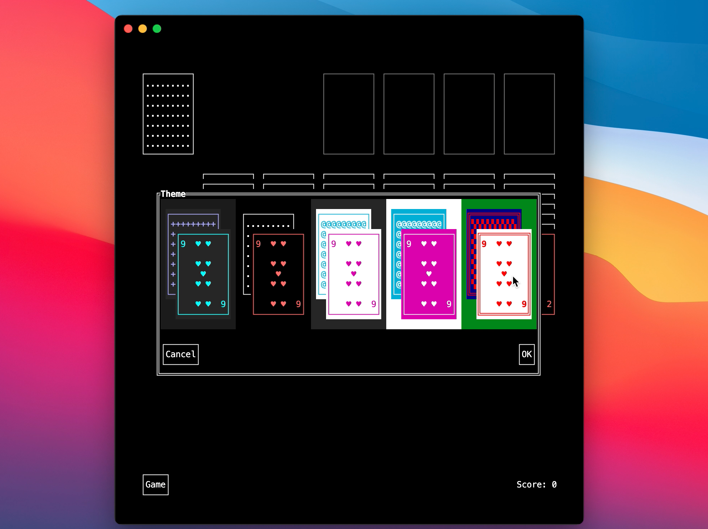

# Impossible Solitaire

Impossible Solitaire is a terminal based version of the classic card game (and Windows 3.x app). **Made with Impossible.js.**

## Installing

Open terminal and run `npm install -g impossible-solitaire`.

## Playing

Just type `solitaire`.

### Mouse Based

This is a mouse based game. Drag-and-Drop, Click and Double Click all work where appropriate.

### Game Options

Game options include choosing a scoring method (Standard, Vegas or None), the card draw mode (one card or three cards) and whether or not to keep cumulative score. In Vegas mode, when in three card draw mode, only three passes through the Stock are allowed. When in one card draw mode, only a single pass is allowed.

### Themes

Game comes with five color themes. Two are "dark", Two are "light" and one is native, meaning that it adapts to the terminal color scheme (including Mac Terminal "Silver Aerogel"). One of the "light" themes is directly inspired by the timeless design of Solitaire for Win 3.x. 

### Undo & Game Log

Any move can be undone (using the menu item or `ctrl z`). The log feature allows direct "time traveling" back to any stage in the game.

### Centered and Responsive

Game board is always centered and is also responsive, so it can be played on anything from a classic 24x80 terminal window to a full screen MacBook one. Utilizing four different board and card designs, the layout responds to terminal window split, terminal window resize and zoom (terminal font change) .

All data persist when app is terminated.

Upon winning, the cards will do their thing 😉.

> App is meant to explore the limits of Impossible as an app framework and the Impossible Collection as a component library. Some implementation details and features may stray away from "the recommended best practices" just to prove a point. Totally worth it.

## Developing

Clone the repo and `cd` into the repo directory.

Run `npm install`.

## Setup

Start the development server: `npm start`. 

This does the following:

- It starts watching source files to generate two app versions: one for node and one for web.
- It starts a dev server on port 8080.

The web version of the app is accessible via `http://localhost:8080/www/`.

The node version of the app is accessible via `node dist`.

An executable version of the app is in the `bin` directory.

Edit files in `src` directory to modify app.

## Building 

Build production bundles using `npm run build`. 

This will generate three apps: 
1. a production version of the web bundle accessible via `http://localhost:8080/www/`
2. a production version of the node app accessible via `node dist`
3. an executable version of the app accessible via `bin/{package-name}.js` where name is the package name from `package.json`. 

## Publishing

### To NPM

README-NPM.md (if exist) will be used as README file for NPM replacing the repo README. A stub is at this repo's root.

Only files in the `bin` directory will be published to the npm registry. `dependencies` and `devDependencies` will be removed from the published package.

Note: if publishing fails, run `node scripts/postpack` to revert.

### To the Web

All required files are in the `www` directory. Can be used with static hosting services such as Netlify and GitHub pages.

# Authors

(c) [Ron Ilan](https://www.ronilan.com)

# License

[NOT LICENSED](./LICENSE.md)

###### Fabriqué au Canada : Made in Canada 🇨🇦
